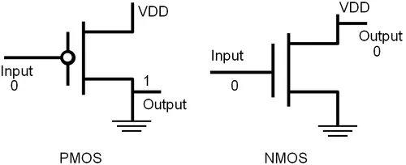
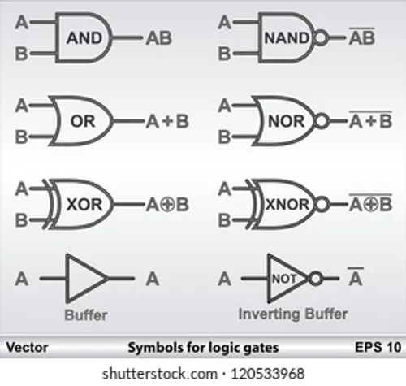

# Part 2 — Logic Gates, Boolean Algebra & Transistors

> A logic gate is a tiny decision machine. Billions of them, working together at nanosecond speeds, are what make computing possible.

---

## From Physics to Logic: The Transistor

Everything digital starts with the **transistor** — a semiconductor device that acts as an electrically controlled switch.

Modern chips use **MOSFETs** (Metal-Oxide-Semiconductor Field-Effect Transistors). There are two types:

- **NMOS (N-channel)**: Gate voltage HIGH → switch CLOSED (conducts)
- **PMOS (P-channel)**: Gate voltage LOW → switch CLOSED (conducts)




```                           
 LOW gate = conducts                 HIGH gate = conducts
 HIGH gate = no current              LOW gate = no current
```

CMOS (Complementary MOS) logic uses both NMOS and PMOS together, which is why modern chips use almost no static power.

### Building a NOT Gate from Transistors

A NOT gate (inverter) takes one input and flips it.

```
Circuit:               
                        
VDD (3.3V)              
    │                      
  [PMOS]──Gate A
    │
    ├──── Output Y
    │
  [NMOS]──Gate A
    │
   GND

When A = 0: PMOS ON, NMOS OFF → Y = VDD = 1
When A = 1: PMOS OFF, NMOS ON → Y = GND = 0
```

This is the basic pattern. All other gates are built from combinations of NMOS and PMOS transistors.

---

## The Seven Fundamental Logic Gates




### NOT (Inverter)

Flips the input. The simplest gate.

```

Truth Table:
┌───┬───┐
│ A │ Y │
├───┼───┤
│ 0 │ 1 │
│ 1 │ 0 │
└───┴───┘

Boolean: Y = A'  (or Ā or NOT A)
```

### AND

Output is 1 only when ALL inputs are 1.

```

Truth Table:
┌───┬───┬───┐
│ A │ B │ Y │
├───┼───┼───┤
│ 0 │ 0 │ 0 │
│ 0 │ 1 │ 0 │
│ 1 │ 0 │ 0 │
│ 1 │ 1 │ 1 │
└───┴───┴───┘

Boolean: Y = A · B  (or AB)
```

### OR

Output is 1 when ANY input is 1.

```
Symbol: 

Truth Table:
┌───┬───┬───┐
│ A │ B │ Y │
├───┼───┼───┤
│ 0 │ 0 │ 0 │
│ 0 │ 1 │ 1 │
│ 1 │ 0 │ 1 │
│ 1 │ 1 │ 1 │
└───┴───┴───┘

Boolean: Y = A + B
```

### NAND (NOT AND)

AND followed by NOT. Output is 0 only when ALL inputs are 1. NAND is **universal** — any logic function can be built from NAND gates alone.

```

Truth Table:
┌───┬───┬───┐
│ A │ B │ Y │
├───┼───┼───┤
│ 0 │ 0 │ 1 │
│ 0 │ 1 │ 1 │
│ 1 │ 0 │ 1 │
│ 1 │ 1 │ 0 │
└───┴───┴───┘

Boolean: Y = (AB)'
```

### NOR (NOT OR)

OR followed by NOT. Output is 1 only when ALL inputs are 0. NOR is also **universal**.

```
Truth Table:
┌───┬───┬───┐
│ A │ B │ Y │
├───┼───┼───┤
│ 0 │ 0 │ 1 │
│ 0 │ 1 │ 0 │
│ 1 │ 0 │ 0 │
│ 1 │ 1 │ 0 │
└───┴───┴───┘

Boolean: Y = (A + B)'
```

### XOR (Exclusive OR)

Output is 1 when inputs are **different**. Used everywhere in arithmetic and error detection.

```
Truth Table:
┌───┬───┬───┐
│ A │ B │ Y │
├───┼───┼───┤
│ 0 │ 0 │ 0 │
│ 0 │ 1 │ 1 │
│ 1 │ 0 │ 1 │
│ 1 │ 1 │ 0 │
└───┴───┴───┘

Boolean: Y = A ⊕ B
```

### XNOR (Exclusive NOR)

Output is 1 when inputs are **equal**. Used in comparators and error detection.

```
Truth Table:
┌───┬───┬───┐
│ A │ B │ Y │
├───┼───┼───┤
│ 0 │ 0 │ 1 │
│ 0 │ 1 │ 0 │
│ 1 │ 0 │ 0 │
│ 1 │ 1 │ 1 │
└───┴───┴───┘

Boolean: Y = (A ⊕ B)'
```

---

## Boolean Algebra

Boolean algebra is the mathematics of logic. It looks like regular algebra but has its own rules.

### Basic Identities

```
Identity laws:      A + 0 = A       A · 1 = A
Null laws:          A + 1 = 1       A · 0 = 0
Idempotent laws:    A + A = A       A · A = A
Complement laws:    A + A' = 1      A · A' = 0
Double negation:    (A')' = A
```

### Key Theorems

```
Commutative:    A + B = B + A           A · B = B · A
Associative:    (A+B)+C = A+(B+C)       (A·B)·C = A·(B·C)
Distributive:   A·(B+C) = A·B + A·C     A+(B·C) = (A+B)·(A+C)
Absorption:     A + A·B = A             A·(A+B) = A
```

### De Morgan's Theorems

These are the most important theorems for circuit simplification:

```
(A · B)' = A' + B'      NOT(AND) = OR of NOTs
(A + B)' = A' · B'      NOT(OR) = AND of NOTs
```

**In words:**
- To negate an AND expression: flip the operation to OR and negate each term
- To negate an OR expression: flip the operation to AND and negate each term

This is how NAND gates become equivalent to OR gates with inverted inputs, and why both NAND and NOR are universal.

---

## Karnaugh Maps (K-Maps)

A **Karnaugh Map** is a visual tool for simplifying Boolean expressions. Instead of algebraic manipulation, you look for patterns.

### 2-Variable K-Map

```
         A=0    A=1
       ┌──────┬──────┐
  B=0  │  m0  │  m2  │
       ├──────┼──────┤
  B=1  │  m1  │  m3  │
       └──────┴──────┘
```

**Example:** Y = A'B' + A'B + AB'

Fill in 1s where expression is 1:
```
         A=0    A=1
       ┌──────┬──────┐
  B=0  │   1  │   1  │   ← A=0,B=0 and A=1,B=0
       ├──────┼──────┤
  B=1  │   1  │   0  │   ← A=0,B=1
       └──────┴──────┘
```

Group the 1s in powers of 2 (groups of 1, 2, 4, 8...):
- Group the top row (2 cells): A=0,B=0 and A=1,B=0 → B' (B is 0 for both, A changes)
- Group the left column (2 cells): A=0,B=0 and A=0,B=1 → A' (A is 0 for both, B changes)

These groups overlap at A=0,B=0. The simplified expression is:

**Y = B' + A'**

### 4-Variable K-Map

```
           AB
        00   01   11   10
      ┌────┬────┬────┬────┐
  00  │    │    │    │    │
      ├────┼────┼────┼────┤
  01  │    │    │    │    │
CD    ├────┼────┼────┼────┤
  11  │    │    │    │    │
      ├────┼────┼────┼────┤
      │    │    │    │    │
  10  └────┴────┴────┴────┘
```

Key rules for grouping:
- Groups must be rectangular (including wrapping around edges)
- Group sizes must be powers of 2: 1, 2, 4, 8, 16
- Use the largest groups possible
- Cover all 1s with minimum number of groups
- Overlapping is allowed and encouraged

---

## Building Functions from Gates

Any Boolean function can be implemented as a circuit. The standard approach:

1. Write the truth table
2. Write the Sum of Minterms (SOM) — OR of all rows where output = 1
3. Simplify with K-map
4. Draw the circuit

**Example: Majority Function**

Output is 1 when majority of three inputs (A, B, C) are 1.

```
Truth Table:
┌───┬───┬───┬───┐
│ A │ B │ C │ Y │
├───┼───┼───┼───┤
│ 0 │ 0 │ 0 │ 0 │
│ 0 │ 0 │ 1 │ 0 │
│ 0 │ 1 │ 0 │ 0 │
│ 0 │ 1 │ 1 │ 1 │  ← 2 of 3 are 1
│ 1 │ 0 │ 0 │ 0 │
│ 1 │ 0 │ 1 │ 1 │  ← 2 of 3 are 1
│ 1 │ 1 │ 0 │ 1 │  ← 2 of 3 are 1
│ 1 │ 1 │ 1 │ 1 │  ← all 3 are 1
└───┴───┴───┴───┘

Sum of Minterms: Y = A'BC + AB'C + ABC' + ABC

K-map simplification:
        AB
      00  01  11  10
    ┌───┬───┬───┬───┐
C=0 │ 0 │ 0 │ 1 │ 0 │
    ├───┼───┼───┼───┤
C=1 │ 0 │ 1 │ 1 │ 1 │
    └───┴───┴───┴───┘

Groups:
- BC column (AB=01 and AB=11, C=1): covers AB'C and ABC → BC
- AC (AB=10 and AB=11, C=1): covers AB'C and ABC' ... 
  Actually: bottom row right two + top right: AB

Simplified: Y = AB + BC + AC
```

Circuit: Three AND gates (AB, BC, AC) fed into a three-input OR gate.

---

## Video Resources

- [Logic Gates from Transistors](https://www.youtube.com/watch?v=sTu3LwpF6XI)
- [Boolean Algebra](https://www.youtube.com/watch?v=gj8QmRQtVao)
- [Karnaugh Maps](https://www.youtube.com/watch?v=RO5alU6PpSU)
- [De Morgan's Theorem](https://www.youtube.com/watch?v=W7YTfLaPWRY&pp=ygUTZGUgbW9yZ2FucyB0aGVvcmVtIA%3D%3D)

---

## Exercises

1. Write the truth table for Y = (A + B) · C
2. Use De Morgan's theorem to simplify: Y = (A·B·C)'
3. Given Y = AB + A'C + BC, verify using a K-map that Y = AB + A'C (BC is redundant)
4. How many transistors does a 2-input NAND gate require in CMOS? Draw the circuit.
5. Design a circuit that outputs 1 when exactly two of three inputs are HIGH.

---

**Next:** [Part 3 — Combinational Circuits](../part3-combinational-circuits/README.md)
