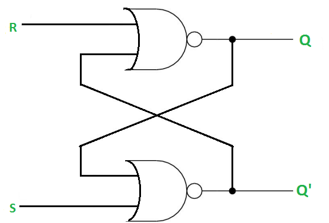
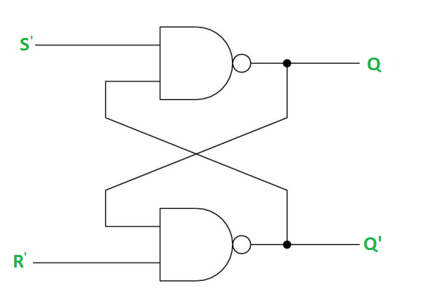

# Part 1 — Latches, Flip-Flops, Registers & Counters

> The moment you add feedback to combinational logic, something remarkable happens: the circuit can remember.

---

## The Problem: Circuits Without Memory

Consider a simple alarm system: "Sound the alarm if the door opens." A combinational circuit handles this. But what about: "Keep the alarm sounding even after the door closes"? Now you need memory — the circuit must remember that the door was opened.

This requires **feedback** — routing an output back as an input.

---

## The SR Latch — Simplest Memory Element

An **SR latch** is built from two cross-coupled NOR (or NAND) gates. It has two inputs: **S** (Set) and **R** (Reset), and two outputs: **Q** and **Q'** (Q-bar, the complement of Q).


NOR-gate SR Latch:


NAND-gate SR Latch:



```
Truth Table (NOR latch):
┌───┬───┬───────────┐
│ S │ R │  Q (next) │
├───┼───┼───────────┤
│ 0 │ 0 │  Q (hold) │  ← remember current state
│ 0 │ 1 │     0     │  ← reset: Q=0
│ 1 │ 0 │     1     │  ← set: Q=1
│ 1 │ 1 │  INVALID  │  ← forbidden state
└───┴───┴───────────┘
```

**The HOLD state (S=0, R=0):** Both NOR gates maintain their current output through feedback. The latch remembers.

**Why S=1, R=1 is forbidden:** Both Q and Q' would be forced to 0 simultaneously, violating the requirement that Q and Q' are always complementary. If you then release both to 0, the final state is unpredictable.

### Limitation: Latches Are Level-Sensitive

A latch responds to its inputs continuously whenever the enable/clock signal is at the appropriate level. This makes timing difficult — if inputs glitch or arrive at different times, the latch may capture incorrect data.

---

## The Clock Signal

Real digital systems synchronize everything to a **clock** — a periodic square wave that alternates between 0 and 1 at a fixed frequency.

```
         │     │‾‾‾‾‾│     │‾‾‾‾‾│   
Clock:   │     │     │     │     │  
         └─────┘     └─────┘     └──

         │←period(T)→│

Frequency f = 1/T

Example: 100 MHz clock → T = 10 ns
```

The clock serves as a heartbeat. Sequential circuits update their state at specific clock edges, not continuously. This makes timing predictable and controllable.

---

## D Flip-Flop — The Workhorse

The **D (Data) flip-flop** is the most commonly used memory element in digital design. It samples its **D** input on the **rising edge** (0→1 transition) of the clock, and holds that value until the next rising edge.

```
Symbol:
         ┌──────┐
    D ───┤  D   ├─── Q
         │  FF  │
   CLK ──┤>     ├─── Q'
         └──────┘

Behavior:
  At every rising edge of CLK: Q ← D
  Between clock edges: Q holds its value regardless of D
```

```
Timing Diagram:

CLK:  ─┐ ┌─┐ ┌─┐ ┌─┐ ┌─
       └─┘ └─┘ └─┘ └─┘

D:    ──┐         ┌─────
        └─────────┘

Q:    ─────────────┐      ← Q captures D=1 only at rising edge
                   └────
                  ↑
                  Rising edge: D=1, so Q becomes 1
```

### D Flip-Flop with Synchronous Reset

In practice, flip-flops include a **reset** input to force Q=0 at startup.

```
Synchronous reset: reset takes effect only at the clock edge
Asynchronous reset: reset takes effect immediately, regardless of clock

// Synchronous reset behavior:
At rising CLK edge:
  if (reset == 1): Q ← 0
  else:            Q ← D
```

---

## Other Flip-Flop Types

### JK Flip-Flop

Like SR, but the forbidden state (J=K=1) is replaced with **toggle** behavior.

```
┌───┬───┬──────────────┐
│ J │ K │   Q (next)   │
├───┼───┼──────────────┤
│ 0 │ 0 │ Q (no change)│
│ 0 │ 1 │      0       │  reset
│ 1 │ 0 │      1       │  set
│ 1 │ 1 │      Q'      │  toggle
└───┴───┴──────────────┘
```

### T (Toggle) Flip-Flop

A JK with J and K tied together. When T=1, the flip-flop toggles every clock cycle. Used to build counters.

```
┌───┬──────────────┐
│ T │   Q (next)   │
├───┼──────────────┤
│ 0 │  Q (hold)    │
│ 1 │      Q'      │  toggle
└───┴──────────────┘
```

---

## Registers

A **register** is simply a bank of D flip-flops sharing the same clock (and usually reset and enable). An N-bit register stores N bits.

```
8-bit Register:

D[7] ── FF ── Q[7]
D[6] ── FF ── Q[6]
D[5] ── FF ── Q[5]
D[4] ── FF ── Q[4]     All share CLK and RST
D[3] ── FF ── Q[3]
D[2] ── FF ── Q[2]
D[1] ── FF ── Q[1]
D[0] ── FF ── Q[0]
```

On a clock edge, all 8 bits are captured simultaneously.

### Shift Register

A chain of flip-flops where each one's output feeds the next one's input. Data shifts one position per clock cycle.

```
      D─[FF0]─Q0─[FF1]─Q1─[FF2]─Q2─[FF3]─Q3
              ↑          ↑          ↑          ↑
             CLK        CLK        CLK        CLK

After each clock edge, data shifts right by one position.
```

**Uses:**
- Serial-to-parallel conversion (receive 1 bit at a time, output 8 bits)
- Parallel-to-serial conversion (the reverse)
- UART receivers
- CRC (error detection)
- Delay lines

---

## Counters

A **counter** is a register whose value increments (or decrements) on each clock edge.

### 4-bit Binary Counter

```
Counts: 0000 → 0001 → 0010 → ... → 1110 → 1111 → 0000 (wraps)

Built from T flip-flops:
  Q0 (bit 0): toggles every clock cycle    (T=1 always)
  Q1 (bit 1): toggles when Q0 = 1
  Q2 (bit 2): toggles when Q0 AND Q1 = 1
  Q3 (bit 3): toggles when Q0 AND Q1 AND Q2 = 1
```
```
CLK  _|‾|_|‾|_|‾|_|‾|_|‾|_|‾|_|‾|_|‾|_|‾|_|‾|_|‾|_|‾|_|‾|_|‾|_|‾|_|‾|

Q0   _|‾‾‾|___|‾‾‾|___|‾‾‾|___|‾‾‾|___|‾‾‾|___|‾‾‾|___|‾‾‾|___|‾‾‾|___

Q1   _|‾‾‾‾‾‾‾|_______|‾‾‾‾‾‾‾|_______|‾‾‾‾‾‾‾|_______|‾‾‾‾‾‾‾|_______

Q2   _|‾‾‾‾‾‾‾‾‾‾‾‾‾‾‾|_______________|‾‾‾‾‾‾‾‾‾‾‾‾‾‾‾|_______________

Q3   _|‾‾‾‾‾‾‾‾‾‾‾‾‾‾‾‾‾‾‾‾‾‾‾‾‾‾‾‾‾‾‾|_______________________________

      0  1  2  3  4  5  6  7  8  9  10 11 12 13 14 15  0  1 ...
```
### Types of Counters

| Type | Description |
|------|-------------|
| **Synchronous** | All flip-flops share the same clock; all change simultaneously |
| **Asynchronous (ripple)** | Each FF clocks from the previous FF's output; simpler but slower |
| **Up counter** | Increments |
| **Down counter** | Decrements |
| **Up/Down counter** | Direction controlled by an input |
| **Modulo-N counter** | Counts 0 to N-1, then resets |
| **Ring counter** | Circulates a single '1' bit |
| **Johnson counter** | Like ring, but feedback is inverted |

### Practical Counter: Frequency Divider

A counter divides the clock frequency. A T flip-flop (1-bit counter) divides by 2. Chaining N flip-flops divides by 2^N.

```
100 MHz input → 1-bit counter → 50 MHz output
100 MHz input → 4-bit counter → 6.25 MHz output (100/16)
```

This is how FPGAs generate slower clocks from a fast reference: clock dividers implemented in fabric or in dedicated PLLs/MMCMs.

---

## Timing Parameters — Critical for Real Designs

### Setup Time (t_su)

The minimum time that D must be stable **before** the clock edge for the flip-flop to reliably capture D.

```
     D must be stable        Clock edge
     during this window      ↓
          ├──── t_su ────┤
D:   ─────────────────────────────────
CLK:                      ↑
```

### Hold Time (t_h)

The minimum time that D must remain stable **after** the clock edge.

```
                 D must remain stable
     Clock edge  during this window
          ↓      ├── t_h ──┤
D:   ────────────────────────────────
CLK:      ↑
```

### Clock-to-Q Delay (t_cq)

The time after the clock edge before Q reflects the captured value.

### Why This Matters for FPGAs

When Vivado synthesizes and implements your design, it performs **static timing analysis** — verifying that:
- Every combinational path between flip-flops is short enough to complete within one clock period
- Setup and hold times are satisfied for every flip-flop

If the timing fails, the circuit may behave incorrectly in silicon even if simulation looks perfect. This is discussed in depth in Week 7.


---

## Exercises

1. Draw the timing diagram for a 3-bit ripple counter with a 10 MHz clock. What is the output frequency at Q2?
2. Design a modulo-6 counter (counts 0–5, resets to 0). Use a 3-bit binary counter with a synchronous reset.
3. How many D flip-flops are needed to store a 32-bit register?
4. A flip-flop has t_su = 2 ns, t_h = 0.5 ns, t_cq = 1 ns. If combinational logic between two flip-flops has a delay of 6 ns, what is the maximum clock frequency?
5. Design an 8-bit shift register with parallel load. On each clock: if Load=1, capture D[7:0]; if Load=0, shift right.

---

**Next:** [Part 2 — Finite State Machines](../part2-fsm/README.md)
